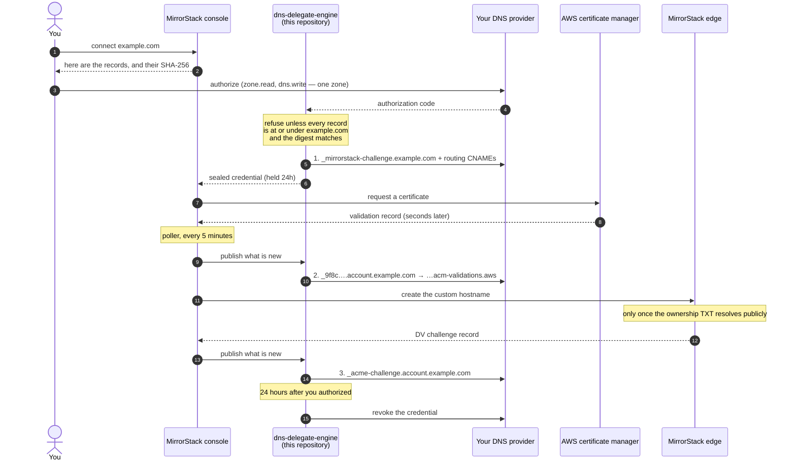
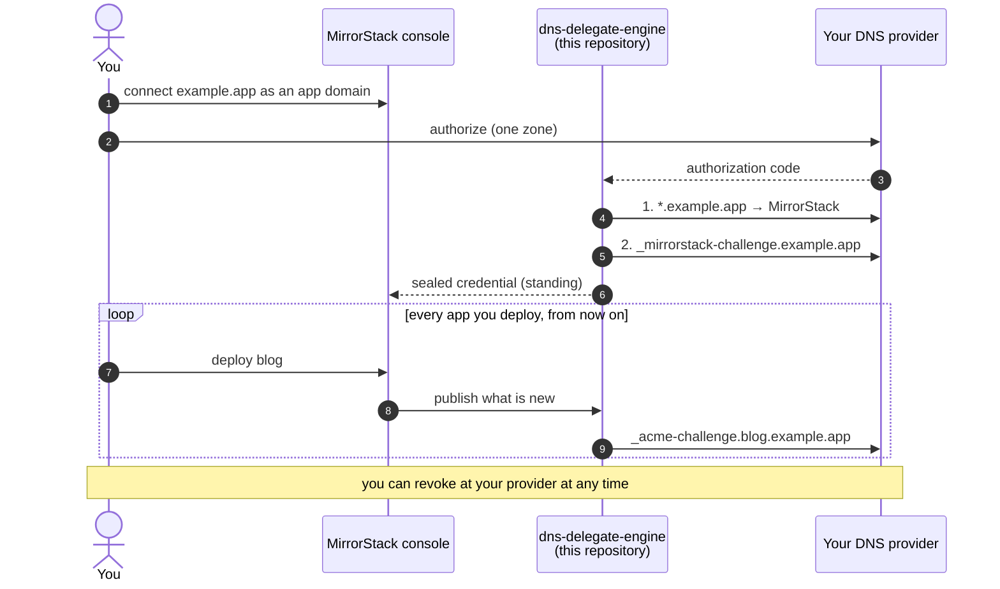

# dns-delegate-engine

The service that holds MirrorStack's delegated DNS credentials — and nothing else.

When you connect a custom domain to [MirrorStack](https://mirrorstack.ai), you can
create the DNS records by hand, or you can authorize us to create them for you.
The second option asks your DNS provider for a write-capable grant on your zone.
That is a real credential, and you are right to want to know what it can do.

This repository is the answer. It is public so that the question **"could
MirrorStack take our company website down?"** can be settled by reading code
instead of by trusting a support reply.

---

## The short version

| Question | Answer | Where to check |
|---|---|---|
| What exactly will you write? | Three kinds of record, and nothing else: one **ownership** proof, one **routing** record per hostname you connect, and the **certificate** records a CA reads. | [What we write](#what-we-write-in-your-zone), and [`ExampleSnapshot_Explain_platformDomain`](internal/dnsplan/example_test.go) prints a real plan |
| Can it delete a DNS record? | **No.** There is no delete call anywhere in this service. | [`internal/dnsprovider/provider.go`](internal/dnsprovider/provider.go) — the `Provider` interface has eight methods, four of which reach the network, and none of them removes anything |
| Can it take over a name I'm already using? | **No.** If something is already answering at that name and it isn't ours, the publish is refused. You delete the record yourself, then authorize again. | [`ErrNameInUse`](internal/reconcile/reconcile.go), and [`TestPublishRefusesToReplaceARecordThatIsNotOurs`](internal/reconcile/reconcile_test.go) |
| Can it touch a name you didn't see? | **No.** Every record must sit at or under the anchor — the exact hostname you proved you own — or the whole plan is refused. | [`internal/dnsplan/plan.go`](internal/dnsplan/plan.go), `NewSnapshot` and `Contains` |
| Can it touch `www`, your apex, or your MX? | **No**, unless the domain you connected *is* that name. Connecting `shop.example.com` cannot reach `example.com`, `www.example.com`, or your mail records. | [`ExampleNewSnapshot_refusesAnythingOutsideTheAnchor`](internal/dnsplan/example_test.go) |
| Can it write an A record, an NS record, a CAA record? | **No.** The plan vocabulary is `CNAME` and `TXT` only, so no write can move your mail, delegate your zone, or change who may issue certificates for you. | [`ExampleNormalizeRecords_acceptsOnlyCNAMEAndTXT`](internal/dnsplan/example_test.go) |
| Will you turn Cloudflare's proxy on in my zone? | **On a certificate record, never** — a plan that proxies one is refused outright. Routing records in a zone you own are DNS-only too, but that is decided before the plan reaches this service, so read it as a description of what we do rather than a bound this repository enforces. | [`assertNoProxiedValidation`](internal/dnsplan/purpose.go) |
| Can what gets written differ from what you approved? | **Not on the pass you authorized.** A SHA-256 over the exact record set is taken before you consent and re-checked here before anything is written. The later passes publish records that did not exist yet, so there is nothing for you to have approved — those are bounded by the anchor instead. | `Snapshot.Digest`, `Snapshot.Validate` |
| How much authority does the grant ask for? | `zone.read` and `dns.write`, on the one zone you pick. The list has a ceiling in code — a wider scope makes this service refuse to start rather than ask you for it. | [`AllowedScopes`](internal/shared/cfoauth/cfoauth.go) |
| How long does the credential live? | A platform-domain grant is held **24 hours**, and not cut short when the last record lands. An app-domain grant is **standing**, because every new app you deploy needs a record created for it — you can revoke it at your provider at any time. | [Grant lifetimes](#grant-lifetimes) |

| What if I stop trusting you? | Revoke at your provider. It works whether or not we cooperate, takes effect immediately, and needs nothing from MirrorStack. Every write we make also lands in your provider's own audit log, attributed to our application. | [What this does not defend against](#what-this-does-not-defend-against) |

If you want to check one thing, check `Contains` in
[`internal/dnsplan/plan.go`](internal/dnsplan/plan.go). It is six lines, and it is
the boundary.

If you want to check the *limits* of all this, skip to
[what it does not defend against](#what-this-does-not-defend-against).

---

## What we write in your zone

Every record in a plan is one of three things. You can tell which from the name
alone, which is why this service can name them without knowing anything about
MirrorStack's topology — see [`Classify`](internal/dnsplan/purpose.go).

| Purpose | Looks like | What it does | If you delete it |
|---|---|---|---|
| **ownership** | `_mirrorstack-challenge.<your-domain>` TXT | Proves the domain is yours. There is exactly one, it sits at the anchor, and every later step is gated on a public lookup finding it. | Nothing today. A future re-check fails. |
| **routing** | `account.<your-domain>` CNAME, or `*.<your-app-domain>` CNAME | Sends visitors to MirrorStack. **The only record here a browser ever follows.** | That hostname goes down. |
| **certificate** | `_acme-challenge.<host>` TXT or CNAME, `_<token>.<host>` CNAME → `…acm-validations.aws` | Read by a certificate authority so TLS can be issued for the hostname. | Nothing today. The certificate fails to **renew**, months later, silently. |

Two properties of that table are enforced rather than described:

- **A reserved name cannot carry traffic.** A validation record's first label
  starts with `_`, which no browser resolves. So a certificate record can never
  be the thing that serves your visitors, and a routing record can never be
  mistaken for one.
- **A validation record is never proxied.** Cloudflare *accepts* the setting
  without complaint and then answers the name with addresses instead of the
  token — issuance fails, or a renewal fails months later while the site is
  still happily serving on its old certificate. Nothing downstream catches that,
  so a plan that would do it is refused here.

### The two lanes

**Your MirrorStack console on your own hostname.** The anchor is the domain you
registered. Up to four sibling hostnames are connected under it (`account`,
`api`, `apps`, `cdn`), and each contributes one routing record plus its own
certificate records. The ownership proof is shared, and there is only one.

**An app domain**, where every app you deploy gets a hostname. The anchor is the
app domain itself, and **one wildcard is all the routing you ever publish** —
but it is not all the DNS. `*.example.app` matches exactly one label, so it
covers `blog.example.app` and never `_acme-challenge.blog.example.app`. Each app
still owes one certificate record of its own. That is the reason this grant is
standing rather than 24 hours: the records it exists to write are for apps that
do not exist yet.

`docs/RECORDS.md` has the complete reference, and the examples in
[`internal/dnsplan/example_test.go`](internal/dnsplan/example_test.go) print real
plans for both lanes. They are `go test` examples, so the documented output
cannot drift from what the code does — if it did, the build fails.

---

## When each record arrives, and why it takes more than one pass

The records are not all knowable when you click Authorize. Two of them are
answers from someone else — AWS and Cloudflare — that do not exist yet at that
moment. This is why the grant is *held* rather than spent once.



Stage 3 cannot happen before stage 1 by construction: the edge mints a DV
challenge only after the custom hostname exists, and the custom hostname is not
created until a public lookup for `_mirrorstack-challenge.<anchor>` — the very
record stage 1 writes — succeeds.

The app lane is the same shape with the stages collapsed and one extra step that
never finishes, which is the honest description of a standing grant:



---

## Why the boundary is here and not in the app

MirrorStack's application platform is a private repository, and publishing it
would not answer your question anyway — you would have to read all of it to be
sure none of it reached your zone.

So the credential does not live there. `api-platform` never holds a DNS provider
token, and this service never derives what records to create. The two halves are
split on purpose:

```
api-platform  (private)                     dns-delegate-engine  (this repo, public)
──────────────────────────                  ─────────────────────────────────────────
authenticates the operator                  holds the provider credential
works out which records are needed
                          ──── plan ───►    ✅ refuses any record outside the anchor
                                            ✅ refuses any plan whose digest moved
                                            ✅ creates and updates; never deletes
                                            ✅ never takes over a name in use
                                            ✅ one bounded window, then it stops
                                                   │
                                                   ▼
                                            your DNS provider
```

The call only ever goes left to right. A bug — or a bad actor — on the private
side cannot get `www.example.com` written, because the plan it sends is checked
here against the name you proved you own, and refused if it does not fit.

That containment check is the reason this repository is small enough to read.

### "But the private side chooses the anchor"

It does, and that is the right question to ask about the arrangement above.

The answer is that **the anchor is sealed into the credential itself.** When a
grant is held, the refresh token is encrypted with

```
"cf-dns-grant\0" + <your organization> + "\0" + <the row> + "\0" + <the anchor>
```

as AES-GCM associated data — see [`GrantAAD`](internal/grant/service.go). The
anchor is not a parameter the credential is *used with*; it is part of what makes
the credential decryptable at all. A grant sealed for `shop.example.com` cannot
be opened later under `example.com`. The attempt does not widen the grant, it
destroys it: the envelope fails to authenticate, the engine reports
`token_unreadable`, and the grant is released.

So an anchor cannot be widened after you consented to it. It can only be chosen
at the start — on the consent screen you read, against the domain you proved you
own, with the record list and its digest in front of you.

---

## What "forward-only" means, and what it costs you

This service creates records and updates records. It never deletes one.

That is not caution for its own sake. No DNS provider in scope offers a
*conditional* mutation — there is no "delete this record, but only if it is still
exactly the one I wrote". So a rollback could not tell the difference between
undoing our own write and overwriting an edit you made thirty seconds ago. Given
those two options, we do not roll back.

**The trade-off is honest:** if a publish fails halfway, some of the approved
records exist and some do not. Nothing of yours has been changed. Re-authorizing
re-reads the current state and finishes the job; it converges.

Two more rules follow from the same reasoning:

**A name already in use is refused, never repointed.** If `account.example.com`
already answers with something that is not ours, we do not move it — your
service would go dark on authorization, with no warning and no undo. The publish
stops there and tells you which name and what it currently answers with. You
delete that record in your own dashboard and authorize again, which is the only
sequence in which the change was ever yours to make. We *will* repair a record
whose target is already ours — that is what lets a half-finished connect
converge — and nothing else.

**An ambiguous write is never retried.** When a write returns a timeout, a rate
limit, or a 5xx, this service **re-reads** to find out what happened. A retry is
how one record becomes two.

---

## Grant lifetimes

There are two kinds of grant, and they are deliberately different.

**Platform domain** (your MirrorStack console at your own hostname) — the record
set is known up front and finite. The grant is held for **24 hours**, long enough
to cover certificate validation records that your provider has not published yet,
and then it is revoked.

Worth being exact about, because it is the less flattering half: the window is
not cut short when the last record lands. A console grant that published
everything on its first pass still holds the credential until the 24 hours are
up. What bounds it is the anchor, not the clock — but if you would rather it were
gone sooner, revoking at your provider ends it immediately and costs you nothing,
because by then there is nothing left to write.

**App domain** (`*.apps.yourcompany.com`, where each app you deploy gets a
hostname) — the record set is *not* known up front, because the apps have not
been created yet. This grant is standing: it exists so that deploying a new app
does not require a fresh authorization each time.

A standing grant is a real trade-off, and it is the one to think hardest about.
Three things bound it: the anchor containment above — the grant can only ever
reach names under the app domain you delegated, and that bound is sealed into the
credential; the refusal to take over any name already in use inside it; and your
provider's own revocation, which works whether or not we are involved. Revoking
at the provider is always available to you and takes effect immediately.

---

## What this does not defend against

Claiming less is the point of publishing this. Everything above bounds what a
*bug on our side* can do to your zone. Here is what it does not do, so you can
weigh the parts that matter to you rather than discover them later.

**The grant covers your whole zone.** `dns.write` cannot be narrowed to a subtree
at the provider — that is the provider's floor, not our choice. Anchor
containment is what reduces it, and containment is code in this repository rather
than a property of the credential. If you want the credential itself to be
smaller, the lever is to connect a subdomain on a zone of its own.

**This service does not know what a registrable domain is.** It refuses anything
outside the anchor, but it has no notion of public suffixes, so it would not
recognise an absurd anchor as absurd. What fixes the anchor is the consent screen
you read and the AAD seal above, which freezes it at that moment — not a check in
here.

**A failed publish leaves part of the list written.** That follows from
forward-only, and it is described above. Nothing of yours is changed, but the
approved set can be half-present until the next pass.

**The name-in-use refusal compares records of the same type.** If you have an `A`
record where the plan wants a `CNAME`, our check does not see it — the write is
attempted and your provider rejects it, because those two cannot coexist. Nothing
of yours is changed either way, but the stop comes from Cloudflare rather than
from us.

**A TXT at `_acme-challenge` is proof of control.** That record is exactly what a
certificate authority accepts as evidence, so this grant implies the ability to
obtain a publicly-trusted certificate for names under the anchor. That is
inherent to automating TLS for a hostname you asked us to serve — it is not a
side effect — but it is worth naming. Your controls for it are `CAA` records and
Certificate Transparency monitoring, and neither depends on us.

**None of this defends against MirrorStack being compromised.** Containment
constrains the code in this repository. If the service itself were subverted, the
bound that still holds is the one you operate: revoking the grant at your
provider works whether or not we cooperate, takes effect immediately, and needs
nothing from us. Every write also appears in your provider's own audit log,
attributed to the MirrorStack application, which is a record we cannot edit.

---

## Multiple providers

Cloudflare is the first provider. The structure is built for others.

The split is deliberate: the rules that bound a write — never delete, read every
affected name before writing any of them, never retry an ambiguous write, one
bounded window — are implemented once, above the interface, in code every
provider shares. An adapter supplies the provider-shaped parts: how a zone is
found, the wire format, how that API spells "already exists" and "this may or may
not have applied", how it quotes a TXT value.

Two of those parts are load-bearing rather than cosmetic, and it is worth saying
so plainly: `IsAmbiguous` decides whether an uncertain write is re-read or
treated as failed, and `SameValue` decides whether a record is recognised as ours.
An adapter cannot *remove* a rule, but a wrong answer from either of these
weakens one. Both are documented at the interface with the direction they must
fail in, and both are tested against the Cloudflare adapter.

`internal/dnsprovider/provider.go` is the whole seam.

---

## Layout

```
dns-delegate-engine/
├── cmd/dns-delegate-api/       Lambda: the RPC surface api-platform calls
├── internal/
│   ├── dnsplan/                the authorization boundary — containment, digest, normalization
│   │   ├── purpose.go            what each record is FOR, read from its name
│   │   ├── explain.go            renders a plan the way the docs describe one
│   │   └── example_test.go       real plans, printed — the documentation, executable
│   ├── dnsprovider/            the provider seam; safety rules live ABOVE it
│   ├── reconcile/              the publisher, and every safety rule
│   ├── provider/cloudflare/    the first adapter
│   ├── grant/                  the RPC surface: authorize, publish, revoke
│   └── shared/                 the OAuth client, the sealing keyset, the JSON envelope
├── docs/RECORDS.md             every record we can write, in full
└── Makefile                    make check — vet, build, race tests, arm64 cross-build
```

**There is no database.** This service owns no table, opens no connection, and
ships no migration. MirrorStack stores every row — including your held grant,
as ciphertext it holds no key for. This service holds the key and the OAuth
client, and has nowhere to persist anything. Neither half can act alone, and
you do not have to reason about a schema to audit what can reach your zone.

## Running the checks yourself

```bash
make check
```

No network, no database, no Cloudflare account. The properties this README
claims are asserted by tests that anyone who clones the repository can run.

To read the record tables as the code produces them:

```bash
go test ./internal/dnsplan/ -run Example -v
```

## License

[FSL-1.1-ALv2](LICENSE) — converts to Apache 2.0 two years after release.
