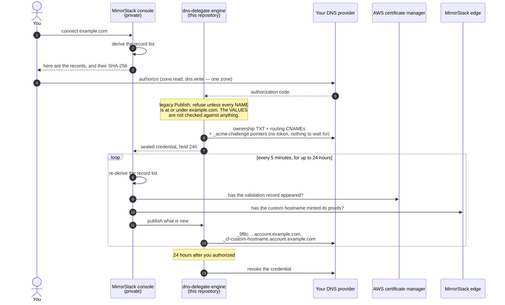
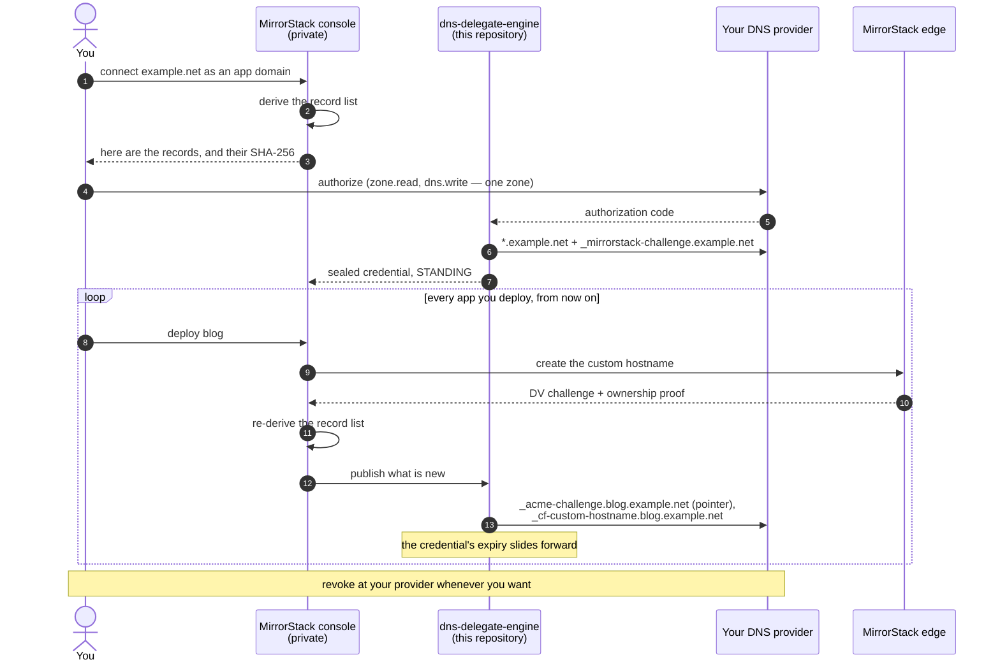
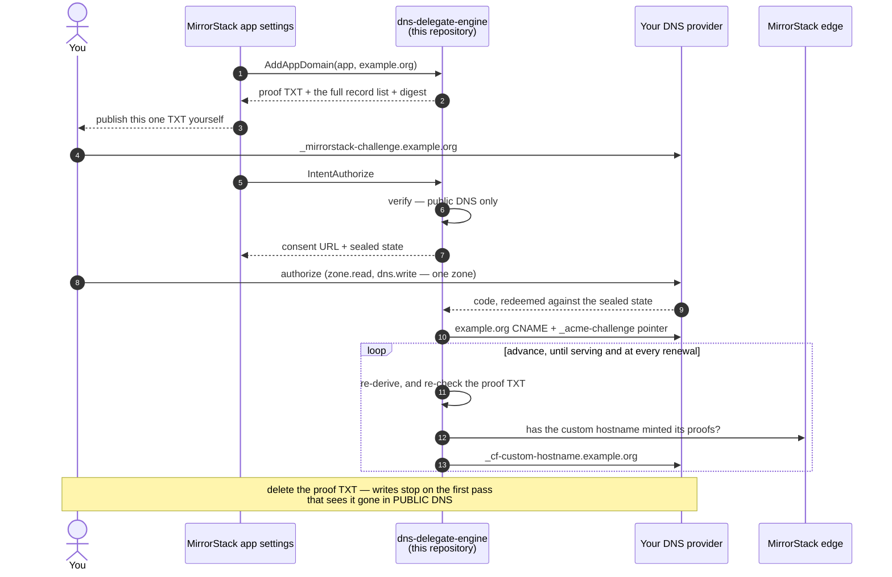
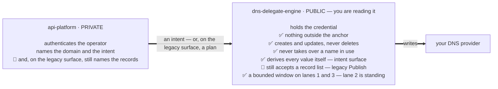

# dns-delegate-engine

The service that holds MirrorStack's delegated DNS credentials — and nothing else.

When you connect a custom domain to [MirrorStack](https://mirrorstack.ai), you can
create the DNS records by hand, or you can authorize us to create them for you.
The second option asks your DNS provider for a write-capable grant on your zone.
That is a real credential, and you are right to want to know what it can do.

This repository is the answer. It is public so that the question **"could
MirrorStack take our company website down?"** can be settled by reading code
instead of by trusting a support reply.

---

## Status, before anything else

**There are two surfaces in this binary, and only one of them is bounded.**

The rebuild described in [`docs/DESIGN.md`](docs/DESIGN.md) is largely built. The
**intent surface** is here: MirrorStack's private half names a lane, an identity
and a **domain**, and can no longer name a DNS record at all. The derivation moved
into this repository — [`internal/derive`](internal/derive/derive.go) is the
package the whole rebuild exists for — so every value that can reach your zone is
now one of exactly three things: computed here, relayed verbatim from AWS or
Cloudflare, or published by you. And the record that proves you own the domain is
one **you** publish: it is derived here so we can tell you what to put there, and
a plan that contains it is refused rather than written.

**The old surface is still routed, in the same binary, behind the same OAuth
client, and it is what production calls today.** `Publish` takes a record list
from the private half, exactly as it always did. Its anchor check bounds a
record's name and never its value, and its digest is optional — the field is
`expectedDigest,omitempty`, so omitting it skips the check.

🔴 **So this branch does not change your answer to the question yet, and it would
be dishonest to imply otherwise.** The two surfaces share one dispatcher, one
OAuth client and one grant. An authorization obtained through the new flow — with
your genuine consent, on a page this service served, against a proof you
published — returns an authorization code, and nothing stops that code being
redeemed against `Publish` with a record list instead of against `Complete`.

`Publish` takes the **anchor** as a request field as well, so the result is not
bounded by the domain you connected at all — it is any `CNAME` or `TXT` anywhere
in the zone your provider authorized. Connect `shop.example.com` and
`www.example.com` is reachable. The two records
[`docs/DESIGN.md`](docs/DESIGN.md) §1 opens with are the mild case:

```
CNAME  account.example.com          →  attacker.example
TXT    _acme-challenge.example.com  →  a third party's ACME token
```

with every check in this repository passing. While both are routed, what
MirrorStack can put in your zone is the **union** of what the intent surface
derives and whatever list the private half hands to the old one, and the weaker
half decides. The bound becomes a property of the **deployment** on the day the
`Publish` case is deleted from the dispatcher, and not one day before. That
deletion is the next step, and it is a change to two repositories in caller-first
order.

Five more things this file would rather you heard from us than found yourself:

- **Whether record 7 appears is a property of the deployment, not of the code.**
  Cloudflare's serving proof is read from MirrorStack's own zone, and the org
  lane and the app lane are different zones — so a deployment names one id per
  lane, and `capabilities` publishes both so you can check which. A lane that
  names none produces no `_cf-custom-hostname`, and a hostname on it can resolve,
  hold a certificate whose status reads active, and still answer 526.
  [`docs/RECORDS.md`](docs/RECORDS.md) describes the record and that failure.
- **Lane 2's consent page does not prove a person read it.** The wildcard lane
  is authorized by posting back a challenge printed on the page this service
  served, so an acknowledgement can only exist where that page was rendered, with
  those exact bytes, for that registration — and neither serving nor
  acknowledging is an RPC action, so the private half cannot do both from the
  surface it calls. What it cannot exclude is the private half fetching the page
  itself: everything a redemption needs is printed on the page, and in production
  the private half is what proxies it to you. The control is over **sequence and
  content, not presence**, and [`docs/DESIGN.md`](docs/DESIGN.md) §4 says so in
  the same words. Nothing this repository can build closes it — a Lambda gated by
  IAM cannot authenticate a browser its own caller is standing in front of.
- **And no deployment serves that page yet.** The route exists on both
  transports; what is missing is infrastructure — a gateway route to this
  function's `/consent` path, and the edge check on whatever proxies it. Until
  one exists, `IntentAuthorize` still answers `consent_required` for
  `org_app_domain` on every deployed build.
- **The digest is required on `Complete`, and it is still not the cross-boundary
  control §4 implies.** It compares a plan derived here against a hex string this
  service handed the caller — `derive(reg) == derive(reg)` — so it catches a bug
  or a configuration change between the screen you saw and the write, not a
  private half that meant you harm. It also covers only the **derived** records:
  relayed records 5 and 7 are merged in afterwards and pass a superset test, so
  they are written with no digest coverage at all. Both are defensible. The claim
  built on top of them was not.
- **The cadence in `internal/schedule` is declared, not enforced.** Nothing in
  this service slows a caller that invokes `Advance` in a loop. What the numbers
  buy you is a published definition to measure us against, not a control.

Everything below describes what this binary does today, both surfaces marked.
Where this file, [`docs/DESIGN.md`](docs/DESIGN.md) and
[`docs/RECORDS.md`](docs/RECORDS.md) disagree, **the code is the truth** — so
every claim here names the file that settles it.

---

## The short version

Most rows are the same on both surfaces, because containment, the never-delete
rule and the never-replace rule all live **below** them, in code both call. Three
rows differ, and those three are what this branch is about: what bounds a
record's **value**, what the digest covers, and what stopping us costs you.

<table>
<thead>
<tr>
<th width="19%">Question</th>
<th width="27%">Intent surface<br>(built, not yet what production calls)</th>
<th width="27%">Legacy <code>Publish</code><br>(still routed, still live)</th>
<th width="27%">Where to check</th>
</tr>
</thead>
<tbody>
<tr>
<td>Can it delete a DNS record?</td>
<td><strong>No.</strong> There is no delete call anywhere in this service.</td>
<td><strong>Same.</strong> One provider interface, shared.</td>
<td><a href="internal/dnsprovider/provider.go"><code>provider.go</code></a> — the <code>Provider</code> interface has eight methods, four of which reach the network, and none of them removes anything</td>
</tr>
<tr>
<td>Can it touch a name you didn't see?</td>
<td><strong>No.</strong> Every record must sit at or under the anchor — the exact hostname you proved you own — or the whole plan is refused.</td>
<td>🔴 <strong>Not the same.</strong> The containment code is shared, but the <em>anchor</em> it checks against arrives as a request field — <code>PublishRequest.Anchor</code> — and on the authorization-code path nothing binds it to anything you proved. What bounds this surface is whatever your provider scoped the grant to, which is <strong>one whole zone</strong>.</td>
<td><a href="internal/dnsplan/plan.go"><code>plan.go</code></a>, <code>NewSnapshot</code> and <code>Contains</code></td>
</tr>
<tr>
<td>Can it touch <code>www</code>, your apex, or your MX?</td>
<td><strong>No</strong>, unless the domain you connected <em>is</em> that name. Connecting <code>shop.example.com</code> cannot reach <code>example.com</code>, <code>www.example.com</code>, or your mail records.</td>
<td>🔴 <strong>Yes.</strong> The anchor is the caller's field here, so a grant taken for <code>shop.example.com</code> is checked against whatever anchor the private half names — anywhere inside the zone your provider authorized.</td>
<td><a href="internal/dnsplan/plan_test.go"><code>plan_test.go</code></a> asserts this of the containment rule; <a href="internal/grant/service.go"><code>grant/service.go</code></a> is where the legacy surface chooses what to apply it to</td>
</tr>
<tr>
<td>Can it write an A record or an MX record?</td>
<td><strong>No.</strong> The plan vocabulary is <code>CNAME</code> and <code>TXT</code> only.</td>
<td><strong>Same.</strong></td>
<td><code>NormalizeRecords</code>, and <a href="internal/dnsplan/plan_test.go"><code>plan_test.go</code></a></td>
</tr>
<tr>
<td>Can it take over a name you're already using?</td>
<td><strong>No.</strong> If something already answers there and it isn't ours, the publish is refused and names what it found. You delete it yourself and authorize again.</td>
<td><strong>Same.</strong> Every safety rule lives above the provider seam, in <code>internal/reconcile</code>.</td>
<td><a href="internal/reconcile/reconcile.go"><code>ErrNameInUse</code></a></td>
</tr>
<tr>
<td>Can what gets written differ from what you approved?</td>
<td><strong>Not the derived records, on the pass you authorized.</strong> The digest is <strong>required</strong> — an empty one is refused — and re-derived before the authorization code is spent. But it compares a plan derived here against a hex string we handed you, so it catches a change between your screen and the write rather than a hostile private half; and relayed records 5 and 7 are merged in <em>after</em> it and carry no digest coverage.</td>
<td>🔴 <strong>The check can be switched off by omitting a field.</strong> <code>expectedDigest</code> is optional here, which makes it a claim rather than a control.</td>
<td><code>Complete</code> in <a href="internal/intent/service.go"><code>intent/service.go</code></a>; <code>PublishRequest.ExpectedDigest</code> in <a href="internal/grant/types.go"><code>grant/types.go</code></a>; <code>Snapshot.Digest</code>, <code>Snapshot.Validate</code>, <code>Snapshot.CoveredBy</code></td>
</tr>
<tr>
<td><strong>Can the private half write a record you did not ask for?</strong></td>
<td><strong>No.</strong> It sends a lane, an identity and a domain, and there is no field in which a record fits. Every value is derived in <code>internal/derive</code>, relayed verbatim from AWS or Cloudflare, or published by you.</td>
<td>🔴 <strong>Yes, today, inside your domain.</strong> Containment bounds a record's name, never its value. This is the defect the rebuild exists to fix, and it is still routed.</td>
<td><a href="internal/derive/derive.go"><code>derive.go</code></a> for the first; the <code>"Publish"</code> case in <a href="cmd/dns-delegate-api/main.go"><code>main.go</code></a> for the second</td>
</tr>
<tr>
<td>Can you stop it once you have started?</td>
<td><strong>Two controls, and one of them does not depend on us.</strong> Revoke at your provider — immediate, and works whether or not we behave. Or delete the ownership TXT: every write stops on the first pass after the deletion is visible in <em>public</em> DNS, which is your record's TTL and then up to one interval plus the jitter. A pass that cannot reach a resolver at all does <strong>not</strong> stop — it publishes and records a warning, because a nameserver failure must not be read as you saying no.</td>
<td>Revocation at your provider, only. There is no proof to delete: on this surface the ownership TXT is written by us.</td>
<td><code>checkProof</code> in <a href="internal/intent/service.go"><code>intent/service.go</code></a>, and <a href="internal/observe/observe.go"><code>observe.go</code></a> on why "unknown" is not "withdrawn"</td>
</tr>
<tr>
<td>How long does the credential live?</td>
<td colspan="2"><strong>Same on both.</strong> A platform-domain grant is held <strong>24 hours</strong>, and is not cut short when the last record lands. An app-domain grant is <strong>standing</strong>, because every new app you deploy needs a record created for it — you can revoke it at your provider at any time.</td>
<td>See <em>Grant lifetimes</em> below, and <code>Lane.GrantLifetime</code> in <a href="internal/lane/lane.go"><code>lane.go</code></a></td>
</tr>
</tbody>
</table>

If you want to check one thing, check the dispatcher in
[`cmd/dns-delegate-api/main.go`](cmd/dns-delegate-api/main.go). It is a single
`switch`, it names every action this service will answer, and it marks the ones
that can write to your zone: `Complete`, `Advance` and `BindAppToOrgAppDomain` on
the intent surface, plus the deprecated `Publish`, which is the only one that
takes its records from the caller.

From there, three files answer the question.
[`internal/derive/derive.go`](internal/derive/derive.go) is **what** can be
written — every derived value, from the lane, the domain, and this deployment's
published routing configuration. It does not produce two of the seven records:
those are relayed verbatim from AWS and Cloudflare in
[`internal/relay`](internal/relay/relay.go), bounded on the way through.
`Contains` in [`internal/dnsplan/plan.go`](internal/dnsplan/plan.go) is
**where** — six lines, and it is the containment both surfaces are checked
against, though the two surfaces differ in what they check it against (see the
table above). [`internal/reconcile`](internal/reconcile/reconcile.go) is what
actually writes.

For the complete list of what lands in your zone, including the two records that
are relayed verbatim from AWS and Cloudflare rather than chosen by anyone at
MirrorStack, see [`docs/RECORDS.md`](docs/RECORDS.md).

---

## Three lanes, and they are not the same

They write different records, wait on different things, and hold the credential
for very different lengths of time. One of them does not come through this
service at all. Read the one you are doing.

| | 1 · org platform domain | 2 · org app domain | 3 · each app domain |
|---|---|---|---|
| example | `example.com` | `example.net` | `example.org` |
| what it is | your console, on your own hostname | a parent under which every app is **auto-routed** at `<app-slug>.example.net` | one arbitrary domain bound to **one app** |
| who owns it | the org | the org | the app — **including a personal app, with no org** |
| routing records | one per sibling host, ×4 | **one wildcard**, `*.example.net` | one, for that hostname |
| AWS certificate records | `account` `api` `apps` — not `cdn` | **none** | **none** |
| the credential | held **24 hours** | **standing** | held **24 hours** |
| consent page | not required | **required**, and 🔴 not yet routed in any deployment | not required |

The lane 1 and lane 2 diagrams below are the **legacy record-list flow** — what
production calls today, defect included. Under each one is what the intent
surface does instead, and which file settles it. Lane 3's diagram is the
**intent** flow, because that lane's older path does not run through this service
at all; the note at the end of that section says what it does run on.

---

## Lane 1 · an org platform domain

Your MirrorStack console, on a hostname you own. The record set is known up front
and finite, so the credential is held only long enough for the two certificate
authorities to answer.

Read step 2 before anything else: on this path **the record list is chosen
entirely by MirrorStack's private half**, and the only thing this service checks
is that each name sits under your domain.



Three things this diagram makes obvious, and exactly what the intent surface does
about each:

- **The loop belongs to the private half.** On this path, every re-derivation and
  every decision about what to publish next happens where you cannot read it.
  On the intent surface the pass is here — `Advance` in
  [`internal/intent`](internal/intent/service.go), one code path shared by every
  lane — and the cadence it should run at is published in
  [`internal/schedule`](internal/schedule/schedule.go): five minutes, a sixty
  second spread, a sixty second floor, 288 passes. 🔴 **That is a declaration and
  not a control.** The private half still holds the list of registrations and the
  clock, and nothing here refuses a caller that invokes `Advance` in a loop. What
  you get is a published number to hold us to and a change log at your provider
  to check it against — which is worth having, and is not the same as a limit.
- **The ownership TXT is written by us, in step 7.** So on this path the record
  that is supposed to prove you own the domain is satisfied by our own write. On
  the intent surface it is `derive.SourceCustomer`: computed in
  [`internal/proof`](internal/proof/proof.go) so we can tell you the exact value,
  handed to you to publish, and **never published by this service** — the whole
  plan is refused if that record appears in the publishable set. `IntentAuthorize`
  then refuses unless it resolves in public DNS at that moment, which is what
  makes deleting it a control rather than a gesture.
- **Three records arrive late** because they are answers from AWS and Cloudflare
  that do not exist when you authorize. That is why the credential is held rather
  than spent once, and it is not going to change.

---

## Lane 2 · an org app domain

One parent, and every app you deploy gets a hostname under it. The record set is
**not** known up front, because the apps do not exist yet — which is the whole
reason this lane's credential behaves differently.

> 🔴 **On the intent surface this lane is authorized by acknowledging a page
> this service served, and no deployment serves that page yet.** `GET /consent`
> renders the disclosure with a challenge over its bytes; posting the challenge
> back mints the acknowledgement `IntentAuthorize` requires. Neither half is an
> RPC action, so MirrorStack's private half cannot do both from the surface it
> calls — but it *can* fetch the page, which is why the honest claim is about
> sequence and content and not about a person having read it
> ([`docs/DESIGN.md`](docs/DESIGN.md) §4). Until a deployment routes that path,
> `IntentAuthorize` answers `consent_required` for `org_app_domain` and the
> legacy path below is what runs.



Three differences from the platform lane that matter:

- **Each app is bound at deploy time, and it may or may not be automatic.** When
  you deploy an app, MirrorStack asks this service to mint that app's
  certificate records. If the parent still holds a live authorization they are
  published for you; if it does not — you never authorized, or you revoked —
  **nothing is written and you get the records to add yourself**. Revoking
  does not break deploys; it turns them manual. That hand-back is both records
  wherever this deployment reads the serving proof for the lane, and only the
  `_acme-challenge` pointer where it does not — `capabilities` names the zone
  each lane reads it from, and the symptom of a lane that has none is a 526 from
  a hostname whose certificate reads perfectly healthy.
- **One wildcard is all the routing you ever publish — but it is not all the
  DNS.** `*.example.net` matches exactly one label, so it covers
  `blog.example.net` and never `_acme-challenge.blog.example.net`. Each app still
  owes a certificate record of its own. A wildcard *custom hostname*, which would
  remove that, is an Enterprise-only feature on the account this runs against. It
  is a real requirement, not a shortcut we took.
- **The credential does not expire while you keep deploying.** That is what
  "standing" means, and it is the honest cost of not asking you to re-authorize
  every time you ship an app. Its expiry slides forward on each publish, so an
  active app domain holds a live grant indefinitely. Lane 1's 24 hours has no
  equivalent here.

That is the trade to think hardest about on this repository. Three things bound
it: the anchor — the grant can only ever reach names under the parent you
delegated; the refusal to take over any name already in use inside it; and your
provider's own revocation, which works whether or not we are involved and takes
effect immediately.

On the intent surface there is a fourth, and it is the reason this lane has a
consent page at all: `*.example.net` is the one grant whose scope you cannot
enumerate for yourself, so the description you act on is rendered by
[`internal/consent`](internal/consent/consent.go) from the same derivation the
writer publishes from — not by a console this repository cannot vouch for. That
control is built, and as the note above says, not yet routed by a deployment.

[`docs/DESIGN.md`](docs/DESIGN.md) is the intent surface's contract: what the
caller may send, what each of the four intents and seven lifecycle functions
does, and what lands in your zone. The diagrams above are the legacy flow; that
document is what replaces it.

---

## Lane 3 · a domain on a single app

An app attaches an arbitrary domain of its own — `example.org`, on one app, not
under any org parent. **It works for a personal app too**, one owned by a person
with no organization anywhere in the picture, which is why this lane takes an app
rather than an organization.

On the intent surface it is authorized exactly like the other two: a Cloudflare
grant, scoped by your provider to one zone, held by this service, and no pasted
API token. **That is not what runs today** — see the migration note at the end of
this section.

This is also the tightest of the three anchors. The anchor **is** the hostname,
so nothing is derived beneath it and nothing beside it is reachable — connecting
`example.org` to an app cannot touch `www.example.org` or anything else in that
zone.

The diagram below is the **intent** flow, and every step of it is in this
repository.



Three things about this lane:

- **No AWS certificate record**, for the same reason as lane 2 — it is a
  Cloudflare-for-SaaS hostname that never reaches AWS from your edge. That also
  makes this the **fastest** of the three: lane 1 waits on AWS *and* Cloudflare,
  this lane waits on Cloudflare alone.
- **The credential is held 24 hours, exactly as lane 1.** The record set here is
  closed — one host, four records, all knowable — so a longer window buys
  nothing. Only lane 2 is standing, and only because apps that do not exist yet
  will need records.
- **Deleting the proof TXT stops the writes, and here is exactly how fast.** Not
  instantly, and this file used to imply otherwise. Every write stops on the
  first pass after the deletion becomes visible in *public* DNS: your record's
  TTL, and then up to one interval plus the jitter — six minutes on the declared
  cadence. A pass that cannot reach a resolver at all does **not** stop; it
  publishes and records a warning, because a nameserver failure must not be read
  as you saying no. That asymmetry is deliberate and written out at `checkProof`:
  *granting* authority needs a positive answer, *continuing* to exercise it stops
  only on a negative one. If you want an immediate stop rather than a bounded
  one, revoke at your provider — that has never depended on us.

> **Not migrated yet.** The flow above is implemented in this repository —
> `AddAppDomain`, `IntentAuthorize`, `Complete`, `Advance` — but production has
> not moved onto it. Today this lane still runs on an older path in MirrorStack's
> private half, where you paste a Cloudflare API token instead: no anchor, no
> digest, and nothing in this repository bounds it. The migration is a change in
> the caller, not here.

---

## Doing it by hand

Every lane can be done manually: you add the records in your own provider and
grant MirrorStack nothing. No credential of yours then exists anywhere in
MirrorStack, and none of the machinery on this page runs.

Worth knowing anyway — **on the intent surface, the list you are asked to add is
derived here**, by the same code that would have written it, and by the same
function that renders the consent page. So the records on your screen and the
records a grant would publish cannot drift apart, and you can read what you will
be asked for before you agree to anything. On the legacy surface that guarantee
does not exist: there the list is derived in the private half and this service
only checks where each name sits.

Revoking a grant returns you to this path. It does not break the domain.

---

## Why the boundary is here and not in the app

MirrorStack's application platform is a private repository, and publishing it
would not answer your question anyway — you would have to read all of it to be
sure none of it reached your zone.

So the credential does not live there. `api-platform` never holds a DNS provider
token. The two halves are split on purpose:



The call only ever goes left to right. A bug — or a bad actor — on the private
side cannot get `www.example.com` written, because every plan is checked here
against the name you proved you own, and refused if it does not fit. What it can
still do, for as long as `Publish` is routed, is choose a record's **value**
inside your own domain. That is the defect the intent surface closes and the
deployment has not yet.

Containment is what made this repository small enough to read. Derivation is what
makes reading it *sufficient* — and it is only sufficient once the legacy surface
is gone.

---

## What "forward-only" means, and what it costs you

This service creates records and updates records. It never deletes one.

That is not caution for its own sake. No DNS provider in scope offers a
*conditional* mutation — there is no "delete this record, but only if it is still
exactly the one I wrote". So a rollback could not tell the difference between
undoing our own write and overwriting an edit you made thirty seconds ago. Given
those two options, we do not roll back.

**The trade-off is honest:** if a publish fails halfway, some of the approved
records exist and some do not. Nothing of yours has been changed. Re-authorizing
re-reads the current state and finishes the job; it converges.

The other rule worth knowing: when a write returns an ambiguous answer — a
timeout, a rate limit, a 5xx — this service **re-reads** to find out what
happened. It never retries the write. A retry is how one record becomes two.

---

## Grant lifetimes

Set out per lane above, and summarised here because it is the question people
come back for. These are the same on both surfaces.

| | 1 · org platform | 2 · org app domain | 3 · each app domain |
|---|---|---|---|
| held for | **24 hours** | **standing** | **24 hours** |
| ends when | the window closes — **not** when the last record lands | you revoke, or stop deploying for long enough | the window closes |
| why | the record set is closed and knowable up front | the records it exists to write are for apps that **do not exist yet** | the record set is closed, and smaller than lane 1 |

The 24-hour window is not cut short when publication finishes. A platform-domain
grant that wrote everything on its first pass still holds the credential until
the window closes; revoking at your provider ends it immediately, and by then
there is nothing left to write.

**Renewal needs no credential**, which is what makes a 24-hour window enough.
The record we publish at `_acme-challenge` is a **pointer, not a token**:
Cloudflare mints and rotates the real tokens behind it, in its own zone, for
every future renewal. Your zone never changes again, so an expired grant has
nothing it would have needed to write.

That matters more than it sounds. Cloudflare's DCV tokens live 7 days on Let's
Encrypt and 14 on Google Trust Services — a form that put the token *in your
zone* would need republishing on that clock, forever, by a credential that is
deliberately short-lived.

Revocation at your provider always works, whether or not we are involved, and
takes effect immediately. It is the one control here that does not depend on
MirrorStack behaving.

---

## Multiple providers

Cloudflare is the first provider. The structure is built for others.

The split is deliberate: everything that *bounds* a write lives above the
provider interface, in code every provider shares. An adapter supplies the
provider-shaped parts — how a zone is found, the wire format, how that API spells
"already exists" and "this may or may not have applied", how it quotes a TXT
value. It cannot opt out of a safety rule, because it never sees one.

`internal/dnsprovider/provider.go` is the whole seam.

---

## Layout

```
dns-delegate-engine/
├── cmd/dns-delegate-api/       Lambda: the RPC surface api-platform calls, and
│                               the dispatcher that routes BOTH surfaces — the
│                               switch in main.go is the shortest complete answer
│                               to "what can this service be asked to do?"
├── internal/
│   │
│   │   ─── the intent surface: a domain and an intent, never a record ───
│   ├── intent/                 the RPC surface — four intents, and the lifecycle:
│   │                           verify, authorize, complete, advance, describe,
│   │                           orphans, release
│   ├── derive/                 WHAT gets written, values included — the package
│   │                           the whole rebuild exists for
│   ├── proof/                  the ownership TXT: derived here, published by YOU,
│   │                           and never written by this service
│   ├── lane/                   the three lanes, and the rules the rest validates
│   │                           against — identity kind, anchor shape, lifetime
│   ├── consent/                the standing-wildcard page, rendered by the code
│   │                           that does the writing, plus the challenge printed
│   │                           on it and the acknowledgement that redeems it
│   ├── observe/                what PUBLIC DNS says about a plan, right now
│   ├── relay/                  records 5 and 7, read verbatim from AWS and
│   │                           Cloudflare — with OUR credentials, in OUR zones,
│   │                           bounded before anyone sees them
│   ├── sealed/                 the two envelopes: a registration, and one
│   │                           authorization in progress
│   ├── schedule/               the declared cadence — a declaration, not a control
│   │
│   │   ─── shared by both surfaces: this is where the safety rules live ───
│   ├── dnsplan/                the authorization boundary — containment, digest,
│   │                           normalization
│   ├── reconcile/              the publisher, and every safety rule
│   ├── dnsprovider/            the provider seam; safety rules live ABOVE it
│   ├── provider/cloudflare/    the first adapter
│   ├── shared/                 the OAuth client, the sealing keyset, MirrorStack's
│   │                           own edge token, the JSON envelope
│   │
│   │   ─── the legacy record-list surface ───
│   └── grant/                  🔴 DEPRECATED and still routed: authorize,
│                               publish(records), revoke. Read this if you want to
│                               know what production calls today.
├── docs/DESIGN.md              the intent surface's contract, in full
├── docs/RECORDS.md             every record we can write, in full
└── Makefile                    make check — vet, build, race tests, arm64 cross-build
```

**There is no database.** This service owns no table, opens no connection, and
ships no migration. MirrorStack stores every row — including your held grant, as
ciphertext — and this service holds the key and the OAuth client with nowhere to
persist anything. You do not have to reason about a schema to audit what can
reach your zone.

**One correction to that, because an earlier version of this file overstated it.**
It said MirrorStack holds the ciphertext "as ciphertext it holds no key for".
That was a property of the **code** and not of the **permissions**: the private
half's account role also held read access to the sealing keyset and the OAuth
client, duplicated onto it at cutover rather than moved. No code used them — the
delegated path runs entirely here — but a granted capability is not the same as
an unused one, and this repository is not the place to describe a permission as
absent because nothing exercises it.

Those grants are being removed, together with the fallback to the legacy path
that needed them. Once it deploys, no private MirrorStack function can read
either secret.

## Running the checks yourself

```bash
make check
```

No network, no database, no Cloudflare account. The properties this README
claims are asserted by tests that anyone who clones the repository can run.

## License

[FSL-1.1-ALv2](LICENSE) — converts to Apache 2.0 two years after release.
