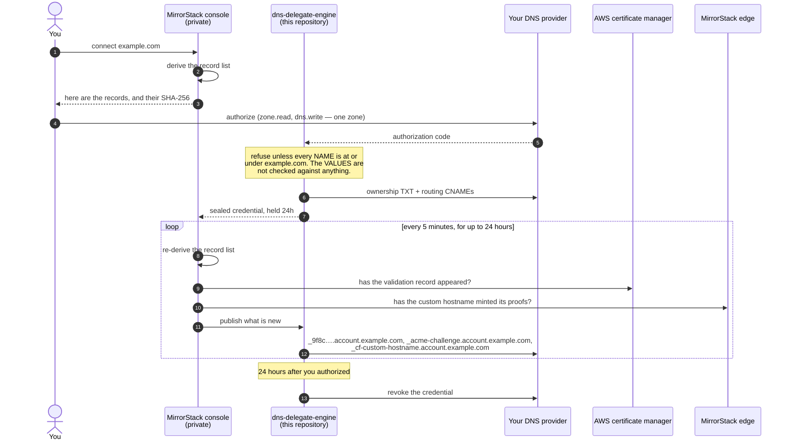
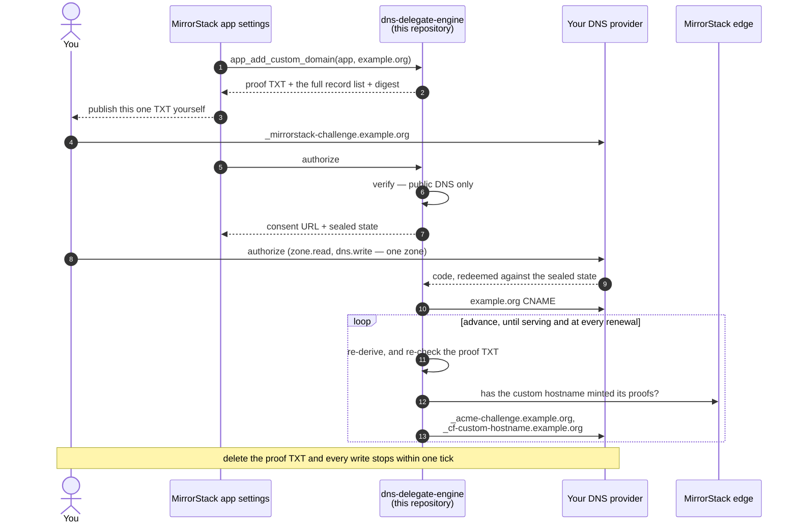
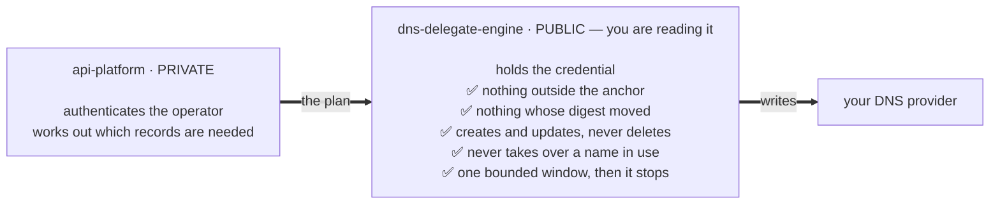

# dns-delegate-engine

The service that holds MirrorStack's delegated DNS credentials — and nothing else.

When you connect a custom domain to [MirrorStack](https://mirrorstack.ai), you can
create the DNS records by hand, or you can authorize us to create them for you.
The second option asks your DNS provider for a write-capable grant on your zone.
That is a real credential, and you are right to want to know what it can do.

This repository is the answer. It is public so that the question **"could
MirrorStack take our company website down?"** can be settled by reading code
instead of by trusting a support reply.

---

## Status, before anything else

This service is **being rebuilt**, and the reason is a defect in what it does
today rather than a feature we want.

Today it takes a list of DNS records from MirrorStack's private half and
publishes them, refusing anything outside the anchor. That bounds **where** we
can write. It does not bound **what** — inside your domain, the private half
picks the record and its value, and a record's value is not something containment
can constrain. So a reader of this repository cannot currently answer the
question it exists to answer.

[`docs/DESIGN.md`](docs/DESIGN.md) is the shape being built: MirrorStack's private
half sends an intent and a domain and can no longer name a record at all, the
derivation moves here, and **the record that proves you own the domain becomes
one you publish rather than one we write.**

Everything below describes what runs **today**. Where this file and the design
disagree, this file is the truth.

---

## The short version

<table>
<thead>
<tr>
<th width="22%">Question</th>
<th width="50%">Answer</th>
<th width="28%">Where to check</th>
</tr>
</thead>
<tbody>
<tr>
<td>Can it delete a DNS record?</td>
<td><strong>No.</strong> There is no delete call anywhere in this service.</td>
<td><a href="internal/dnsprovider/provider.go"><code>provider.go</code></a> — the <code>Provider</code> interface has eight methods, four of which reach the network, and none of them removes anything</td>
</tr>
<tr>
<td>Can it touch a name you didn't see?</td>
<td><strong>No.</strong> Every record must sit at or under the anchor — the exact hostname you proved you own — or the whole plan is refused.</td>
<td><a href="internal/dnsplan/plan.go"><code>plan.go</code></a>, <code>NewSnapshot</code> and <code>Contains</code></td>
</tr>
<tr>
<td>Can it touch <code>www</code>, your apex, or your MX?</td>
<td><strong>No</strong>, unless the domain you connected <em>is</em> that name. Connecting <code>shop.example.com</code> cannot reach <code>example.com</code>, <code>www.example.com</code>, or your mail records.</td>
<td><a href="internal/dnsplan/plan_test.go"><code>plan_test.go</code></a> asserts exactly this</td>
</tr>
<tr>
<td>Can it write an A record or an MX record?</td>
<td><strong>No.</strong> The plan vocabulary is <code>CNAME</code> and <code>TXT</code> only.</td>
<td><code>NormalizeRecords</code>, and <a href="internal/dnsplan/plan_test.go"><code>plan_test.go</code></a></td>
</tr>
<tr>
<td>Can it take over a name you're already using?</td>
<td><strong>No.</strong> If something already answers there and it isn't ours, the publish is refused and names what it found. You delete it yourself and authorize again.</td>
<td><a href="internal/reconcile/reconcile.go"><code>ErrNameInUse</code></a></td>
</tr>
<tr>
<td>Can what gets written differ from what you approved?</td>
<td><strong>Not on the pass you authorized</strong> — a SHA-256 over the record set is taken before you consent and re-checked before anything is written. Later passes publish records that did not exist yet, so there was nothing to approve; those are bounded by the anchor. And the check is <strong>skipped if the caller omits the digest</strong>, so it defends against a bug in the private half, not against the private half.</td>
<td><code>Snapshot.Digest</code>, <code>Snapshot.Validate</code></td>
</tr>
<tr>
<td><strong>Can the private half write a record you did not ask for?</strong></td>
<td>🔴 <strong>Yes, today, inside your domain.</strong> Containment bounds a record's name, never its value. This is the defect the rebuild exists to fix.</td>
<td><a href="docs/DESIGN.md"><code>docs/DESIGN.md</code></a></td>
</tr>
<tr>
<td>How long does the credential live?</td>
<td>A platform-domain grant is held <strong>24 hours</strong>, and is not cut short when the last record lands. An app-domain grant is <strong>standing</strong>, because every new app you deploy needs a record created for it — you can revoke it at your provider at any time.</td>
<td>See <em>Grant lifetimes</em> below</td>
</tr>
</tbody>
</table>

If you want to check one thing, check `Contains` in
[`internal/dnsplan/plan.go`](internal/dnsplan/plan.go). It is six lines, and it is
the boundary — and then read [`docs/DESIGN.md`](docs/DESIGN.md) for why six lines
bounding a *name* is not enough, and what replaces it.

For the complete list of what lands in your zone, including the two records that
are relayed verbatim from AWS and Cloudflare rather than chosen by anyone at
MirrorStack, see [`docs/RECORDS.md`](docs/RECORDS.md).

---

## Three lanes, and they are not the same

They write different records, wait on different things, and hold the credential
for very different lengths of time. One of them does not come through this
service at all. Read the one you are doing.

| | 1 · org platform domain | 2 · org app domain | 3 · each app domain |
|---|---|---|---|
| example | `example.com` | `example.net` | `example.org` |
| what it is | your console, on your own hostname | a parent under which every app is **auto-routed** at `<app-slug>.example.net` | one arbitrary domain bound to **one app** |
| who owns it | the org | the org | the app — **including a personal app, with no org** |
| routing records | one per sibling host, ×4 | **one wildcard**, `*.example.net` | one, for that hostname |
| AWS certificate records | `account` `api` `apps` — not `cdn` | **none** | **none** |
| the credential | held **24 hours** | **standing** | **standing**, for renewals |

The diagrams below are today's flow, defect included.

---

## Lane 1 · an org platform domain

Your MirrorStack console, on a hostname you own. The record set is known up front
and finite, so the credential is held only long enough for the two certificate
authorities to answer.

Read step 2 before anything else: **the record list is chosen entirely by
MirrorStack's private half**, and the only thing this service checks is that each
name sits under your domain.



Three things this diagram makes obvious, and which the rebuild changes:

- **The loop belongs to the private half.** Every re-derivation, every decision
  about what to publish next, happens where you cannot read it. This service is
  called once per pass and told what to write.
- **The ownership TXT is written by us, in step 7.** It is also what gates the
  custom hostname in step 13 — so the record that is supposed to prove you own
  the domain is satisfied by our own write.
- **Three records arrive late** because they are answers from AWS and Cloudflare
  that do not exist when you authorize. That is why the credential is held rather
  than spent once, and it is not going to change.

---

## Lane 2 · an org app domain

One parent, and every app you deploy gets a hostname under it. The record set is
**not** known up front, because the apps do not exist yet — which is the whole
reason this lane's credential behaves differently.


Two differences from the platform lane that matter:

- **One wildcard is all the routing you ever publish — but it is not all the
  DNS.** `*.example.net` matches exactly one label, so it covers
  `blog.example.net` and never `_acme-challenge.blog.example.net`. Each app still
  owes a certificate record of its own. A wildcard *custom hostname*, which would
  remove that, is an Enterprise-only feature on the account this runs against. It
  is a real requirement, not a shortcut we took.
- **The credential does not expire while you keep deploying.** That is what
  "standing" means, and it is the honest cost of not asking you to re-authorize
  every time you ship an app. Its expiry slides forward on each publish, so an
  active app domain holds a live grant indefinitely. Lane 1's 24 hours has no
  equivalent here.

That is the trade to think hardest about on this repository. Three things bound
it: the anchor — the grant can only ever reach names under the parent you
delegated; the refusal to take over any name already in use inside it; and your
provider's own revocation, which works whether or not we are involved and takes
effect immediately.

[`docs/DESIGN.md`](docs/DESIGN.md) describes the shape being built, where the
loop, the derivation and the proof all move — and explains each function of the
intent-based API that replaces the record list.

---

## Lane 3 · a domain on a single app

An app attaches an arbitrary domain of its own — `example.org`, on one app, not
under any org parent. **It works for a personal app too**, one owned by a person
with no organization anywhere in the picture, which is why this lane takes an app
rather than an organization.

It is authorized exactly like the other two: a Cloudflare grant, scoped by your
provider to one zone, held by this service. There is no separate mechanism and no
pasted API token.

This is also the tightest of the three anchors. The anchor **is** the hostname,
so nothing is derived beneath it and nothing beside it is reachable — connecting
`example.org` to an app cannot touch `www.example.org` or anything else in that
zone.



Two differences from the org lanes:

- **No AWS certificate record**, for the same reason as lane 2 — it is a
  Cloudflare-for-SaaS hostname that never reaches AWS from your edge.
- **The grant is standing rather than 24 hours**, because a certificate renews
  months later against a freshly minted challenge. Same trade as lane 2, and the
  same two stop controls: delete the proof TXT, or revoke at your provider.

> **Not migrated yet.** Today this lane still runs on an older path in
> MirrorStack's private half, where you paste a Cloudflare API token instead —
> no anchor, no digest, and nothing in this repository bounds it. The shape above
> is what it becomes, and the migration is
> [`docs/DESIGN.md`](docs/DESIGN.md)'s third intent. Until it ships, treat this
> page's claims as covering lanes 1 and 2.

---

## Why the boundary is here and not in the app

MirrorStack's application platform is a private repository, and publishing it
would not answer your question anyway — you would have to read all of it to be
sure none of it reached your zone.

So the credential does not live there. `api-platform` never holds a DNS provider
token, and this service never derives what records to create. The two halves are
split on purpose:



The call only ever goes left to right. A bug — or a bad actor — on the private
side cannot get `www.example.com` written, because the plan it sends is checked
here against the name you proved you own, and refused if it does not fit.

That containment check is the reason this repository is small enough to read.

---

## What "forward-only" means, and what it costs you

This service creates records and updates records. It never deletes one.

That is not caution for its own sake. No DNS provider in scope offers a
*conditional* mutation — there is no "delete this record, but only if it is still
exactly the one I wrote". So a rollback could not tell the difference between
undoing our own write and overwriting an edit you made thirty seconds ago. Given
those two options, we do not roll back.

**The trade-off is honest:** if a publish fails halfway, some of the approved
records exist and some do not. Nothing of yours has been changed. Re-authorizing
re-reads the current state and finishes the job; it converges.

The other rule worth knowing: when a write returns an ambiguous answer — a
timeout, a rate limit, a 5xx — this service **re-reads** to find out what
happened. It never retries the write. A retry is how one record becomes two.

---

## Grant lifetimes

Set out per lane above, and summarised here because it is the question people
come back for.

| | platform domain | app domain |
|---|---|---|
| held for | **24 hours** | **standing** |
| ends when | the window closes — **not** when the last record lands | you revoke, or you stop deploying for long enough |
| why | the record set is finite and known up front | the records it exists to write are for apps that do not exist yet |

The 24-hour window is not cut short when publication finishes. A platform-domain
grant that wrote everything on its first pass still holds the credential until
the window closes; revoking at your provider ends it immediately, and by then
there is nothing left to write.

Revocation at your provider always works, whether or not we are involved, and
takes effect immediately. It is the one control here that does not depend on
MirrorStack behaving.

---

## Multiple providers

Cloudflare is the first provider. The structure is built for others.

The split is deliberate: everything that *bounds* a write lives above the
provider interface, in code every provider shares. An adapter supplies the
provider-shaped parts — how a zone is found, the wire format, how that API spells
"already exists" and "this may or may not have applied", how it quotes a TXT
value. It cannot opt out of a safety rule, because it never sees one.

`internal/dnsprovider/provider.go` is the whole seam.

---

## Layout

```
dns-delegate-engine/
├── cmd/dns-delegate-api/       Lambda: the RPC surface api-platform calls
├── internal/
│   ├── dnsplan/                the authorization boundary — containment, digest, normalization
│   ├── dnsprovider/            the provider seam; safety rules live ABOVE it
│   ├── reconcile/              the publisher, and every safety rule
│   ├── provider/cloudflare/    the first adapter
│   ├── grant/                  the RPC surface: authorize, publish, revoke
│   └── shared/                 the OAuth client, the sealing keyset, the JSON envelope
├── docs/DESIGN.md              the shape this is being rebuilt into
├── docs/RECORDS.md             every record we can write, in full
└── Makefile                    make check — vet, build, race tests, arm64 cross-build
```

**There is no database.** This service owns no table, opens no connection, and
ships no migration. MirrorStack stores every row — including your held grant, as
ciphertext — and this service holds the key and the OAuth client with nowhere to
persist anything. You do not have to reason about a schema to audit what can
reach your zone.

🔴 **One correction to that, because an earlier version of this file overstated
it.** It said MirrorStack holds the ciphertext "as ciphertext it holds no key
for". That is a property of the **code** and not yet of the **permissions**: the
private half's account role still has read access to both the sealing keyset and
the OAuth client, left behind by the pre-cutover in-process path that this
service replaced. No code uses it — the delegated path runs entirely here — but a
granted capability is not the same as an unused one, and this repository is not
the place to describe a permission as absent because nothing exercises it.
Removing those grants is the outstanding half of the cutover.

## Running the checks yourself

```bash
make check
```

No network, no database, no Cloudflare account. The properties this README
claims are asserted by tests that anyone who clones the repository can run.

## License

[FSL-1.1-ALv2](LICENSE) — converts to Apache 2.0 two years after release.
