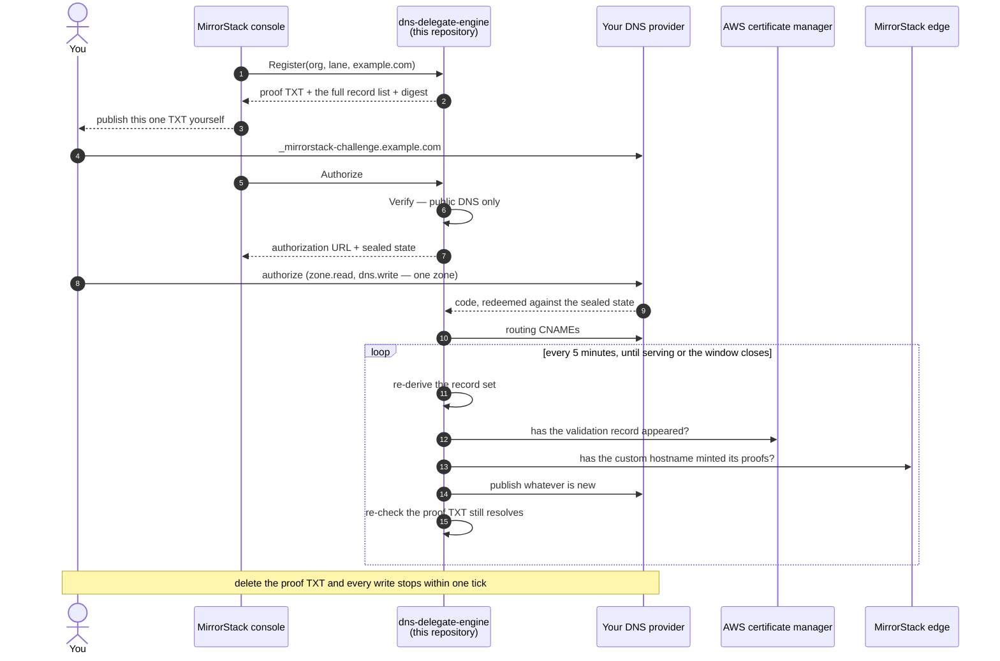
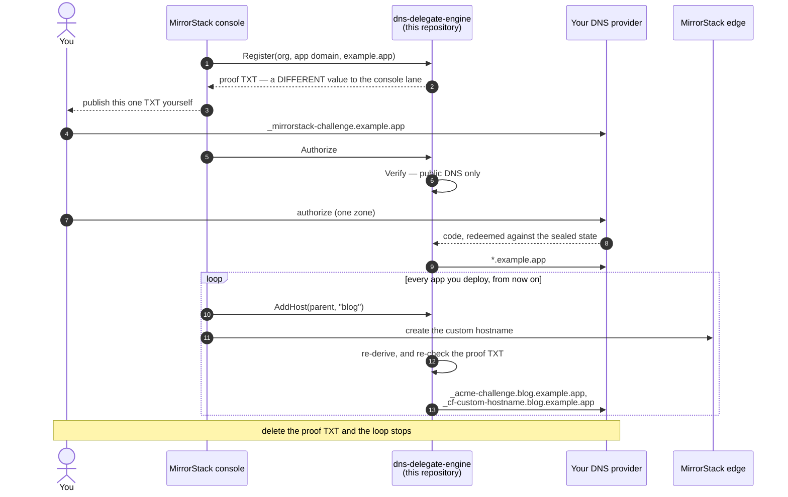

# Proven Anchors

The shape this service is being rebuilt into, and why the shape it has today
cannot answer the question the repository exists to answer.

> **Status: design. Not built.** Everything in this document describes the target.
> What runs today is described in [`../README.md`](../README.md), and where the two
> disagree, the README is the truth. This file is here first, and in public,
> because the design is the part a customer's own developers most need to argue
> with — after it ships is too late to tell us it is wrong.

---

## 1. The problem

The engine today takes `Publish(records)`. Every byte that reaches a customer's
zone originates in `PublishRequest.Records`, decoded straight into
`{Type, Name, Value, Proxied}` and handed to the provider. Anchor containment
bounds a record's **name** to a suffix of the anchor.

**Nothing bounds the value at all.** So the private half can publish, with every
check in this public repository passing:

```
CNAME  account.<anchor>          →  attacker.example
TXT    _acme-challenge.<host>    →  <a third party's ACME token>
```

The first puts a session host inside the customer's own domain in front of
someone else's origin. The second lets that third party obtain a
publicly-trusted certificate for the customer's hostname — and note that the
never-replace rule is CNAME-only. TXT records always **add**, and a certificate
authority accepts any matching TXT among several at one owner. Containment
structurally cannot bound a TXT value.

A customer's developer reading this repository learns **where** we can write and
nothing about **what**. That is the whole objection, and it is correct.

Two further facts, stated because they are unflattering and true:

- **Both cross-boundary integrity checks are caller-optional.** `ExpectedDigest`
  and `Reviewed` are each skipped when absent, and `Reviewed` has never been
  populated by any caller. The digest is a defence against bugs in the private
  half, never against the private half.
- **The anchor is not proven.** Today the ownership TXT is inside the record set
  *we* publish, and the gate on creating a custom hostname is a public lookup for
  that same record. The proof is satisfied by our own write. "The hostname you
  proved you own" currently describes no code.

That second one is why an intent-level API is not by itself the fix. If the
private half names the domain and the proof is self-fulfilling, it can still aim
this service at any name inside a zone the customer authorized — and the
provider's consent screen names the *zone*, never the subdomain.

---

## 2. The change

**The ownership TXT stops being a record we write and becomes a record the
customer writes**, re-verified on every pass.

Everything else follows from it. The customer gains a proof we cannot forge and
a stop control we cannot suppress: delete that one TXT and every write from this
service stops within one tick, without touching MirrorStack, without a support
ticket, and without waiting for a grant to expire.

The cost is one manual TXT per registrable domain, once, before the first
connect. Everything under a proven parent stays one click.

---

## 3. The operation set

The private half sends an **intent** and an **identity**. Across every operation
it supplies exactly these strings and no others:

| field | validation |
|---|---|
| `orgId` | canonical 36-char hyphenated UUID, strict |
| `lane` | one of three |
| `domain` | one DNS name, ≤253, LDH labels, refused if under a MirrorStack suffix |
| `label` | one LDH label — no leading `_`, not `*`, not a reserved sibling name |
| `code` / `codeVerifier` / `codeChallenge` | provider and PKCE; reach no record |
| sealed envelopes | ciphertext this service issued |

There is **no** records field, no value, no target, no proxy flag, no certificate
id, no hostname id, no ownership token, no expiry, no stage.

A reflection test walks every request struct and **fails on any type it does not
recognise** — not merely on unknown string fields. A map, a `json.RawMessage` or
a nested struct is rejected by default rather than by having been thought of.

### Lanes

| lane | anchor | hosts |
|---|---|---|
| `org_console` | the customer's parent domain | `account.` `api.` `apps.` `cdn.` |
| `org_app_domain` | the app domain | none directly; one per app, via `AddHost` |
| `app_host` | the hostname itself | itself |

### Operations

| operation | does |
|---|---|
| `Capabilities` | the effective config — lanes, routing targets, suffix list, scopes, derivation version, deployed sha |
| `Register` | derives the host set and mints the proof value. Touches no credential, writes no zone |
| `AddHost` | one label under an already-proven app-domain anchor |
| `Describe` | read-only: every record, its purpose, and whether it is present, absent, conflicting or the wrong type |
| `Verify` | public DNS only. The caller cannot say what to look for, and cannot make it pass |
| `Authorize` | mints the OAuth `state`. Refuses unless `Verify` passes right now |
| `Complete` | exchanges the code, seals the grant, publishes. Takes **no** org, lane or domain — the intent comes from the sealed `state` |
| `Advance` | one poller pass: re-derive, pull, publish what is missing |
| `Orphans` | reports what we left behind. A report, never a mutation |
| `Release` | revokes at the provider |
| `Health` | the deployed sha, so every other property is verifiable rather than merely readable |

Two of these carry the design:

**`Register`** mints the proof value as
`HMAC(K, LP("ms-challenge-v2") ‖ LP(lane) ‖ LP(orgId) ‖ LP(anchor))`, length-prefixed
so `("a", "b.com")` cannot collide with `("ab", ".com")`. **The lane is inside the
HMAC**, so a console proof does not authorize the app-domain wildcard. Each lane
needs its own deliberate act by the customer. It is deterministic: re-registering
the same tuple yields the same proof, so losing an envelope is recoverable and the
customer's published TXT keeps working.

**`Complete`** takes no org, no lane and no domain. The intent is derived from the
sealed `state` that `Authorize` minted, so `Authorize` and `Complete` are
cryptographically the same act. That is what closes consent laundering at the
mechanism level rather than by checking that two request fields agree.
`expectDigest` is **required**, and an empty value is refused — an optional
integrity check is a claim, not a control.

---

## 4. Where state lives

**This service still owns no database.** Not by sealing the lifecycle, but by
deleting it: the certificate id, the custom-hostname id and the published-record
cursor are removed from the model and re-read from AWS, from Cloudflare and from
the customer's own zone on every pass.

What stays sealed is a credential and a clock, both of which are monotone-safe
under replay — rolling one back grants no authority it did not already carry.
The private half stores the envelopes and hands them back; it cannot author,
edit or reorder one.

This is the honest limit of that: a sealed envelope can be **withheld**. The
private half can always decline to advance a domain. What it cannot do is advance
one further than the customer proved.

---

## 5. Every record this service can emit

| # | name | type | value | lane | written by |
|---|---|---|---|---|---|
| 1 | `_mirrorstack-challenge.<anchor>` | TXT | `HMAC(K, lane‖org‖anchor)` | all | 🔴 **the customer, by hand** |
| 2 | `account\|api\|apps\|cdn.<anchor>` | CNAME | the org routing target | console | this service |
| 3 | `*.<anchor>` | CNAME | the app routing target | app domain | this service |
| 4 | `<hostname>` | CNAME | the app routing target | app host | this service |
| 5 | `_<token>.<host>` | CNAME | `….acm-validations.aws` | console | verbatim from AWS |
| 6 | `_acme-challenge.<host>` | TXT | the DV token | all | verbatim from Cloudflare |
| 7 | `_acme-challenge.<host>` | CNAME | `<uuid>.dcv.cloudflare.com` | config-gated, **off** | this service |
| 8 | `_cf-custom-hostname.<host>` | TXT | `ownership_verification` | all | verbatim from Cloudflare |

Four things about that table matter more than the table:

**Records 5, 6 and 8 are relayed, not derived.** This service derives *that* a
proof must exist and *why*; the bytes come from AWS and Cloudflare. "The engine
derives the record set" is true at the level of which proofs exist and false at
the level of every byte. Both halves of that sentence belong in public.

**Record 8 is a second, separate proof.** `_cf-custom-hostname` is not a
certificate record and its absence does not fail a certificate — it makes
Cloudflare decline to *route* the hostname, producing a 526 while the certificate
status reads healthy. Different reader, different wait, different failure. It is
minted when the custom hostname is created; record 6 is minted after the routing
record resolves. Naming them with one word would name the wrong blocker.

**Record 7 is disarmed in production** and must be derived only when configured.
Records 6 and 7 sit at the same owner, and a CNAME and a TXT cannot coexist
there — emitting both does not merely fail, it blocks the record issuance needs,
silently. That collision gets a named non-retryable refusal.

**`proxied` is always false**, and this service ships a one-line rule that
refuses to publish into a MirrorStack suffix at all, fail-closed. The proxy
decision, the shard coupling and the edge-secret transform stay private — a large
disclosure avoided, and the reason platform-zone anchors stay on the private path
rather than being re-derived here.

**No A, AAAA, MX, NS or CAA, ever.** CNAME and TXT only.

---

## 6. The sequence, with the waits that are real

Two of these records are answers from someone else that do not exist when the
customer authorizes. That is why this is a convergence loop and not a script,
and why the credential is held rather than spent once.



The self-arrows are the point. Step by step this is a script; the loop is what
makes it converge, and the re-check inside it is what makes the customer's stop
control real rather than advisory.

### The app-domain lane

Same skeleton, one wildcard, and a loop with no end — which is the honest picture
of a standing grant. The proof is separate from the console lane's, because the
lane is inside the HMAC: authorizing a console does not authorize a wildcard.



`AddHost` carries the one caller-chosen string that survives anywhere in this
design: a single label under an already-proven parent. It selects **which** name,
never **what** is written there, and it cannot spell `_acme-challenge`, `_dmarc`,
`_domainkey`, a sibling console name, or a wildcard.

Note step 2. A console proof and an app-domain proof are different values for the
same domain, because `lane` is inside the HMAC — so a customer who proved a
console anchor has not thereby authorized a wildcard over every name under it.
That is a deliberate second act, and §9 argues it needs a consent surface of its
own on top.

Ordering that is genuinely forced, rather than incidental:

- The custom hostname is not created until the proof TXT resolves publicly, so
  record 8 cannot precede record 1.
- Cloudflare mints record 6 only after the routing record resolves, so it cannot
  precede record 2, 3 or 4.
- AWS returns a certificate id immediately and its validation record seconds
  later, so a fresh host is routinely "requested, record not known yet" for the
  first minutes of its life. That is a wait, not a fault.

---

## 7. Credentials

This service holds the customer's delegated grant, the key that seals it, and the
OAuth client. The redesign adds **read-only** access to MirrorStack's own AWS and
Cloudflare accounts, and nothing more:

| | this service | stays private |
|---|---|---|
| the customer's DNS grant | ✅ | |
| the sealing keyset, the OAuth client | ✅ | |
| read a certificate's validation record | ✅ | |
| read a custom hostname's minted proofs | ✅ | |
| **request** a certificate | | ✅ |
| **create** a custom hostname | | ✅ |
| API Gateway, shards, the edge-secret transform | | ✅ |

The rule behind that split: a public service that exists to *bound* a credential
must not hold more authority than the credential it bounds. Certificate issuance
on an unnarrowable resource, or a provider token that cannot separate SSL
administration from DNS editing, would invert the premise of the repository.

---

## 8. What this discloses

Moving derivation here publishes MirrorStack's host naming, its routing targets
and its certificate lifecycle. That is a real disclosure and it is accepted
deliberately: obscurity was never the security property, and the values in
question are already in the customer's own zone the moment we write them.

What stays private is the part that is genuinely internal and genuinely
irrelevant to the question: the proxy decision, the shard topology, the
authorizer header and its transform rule.

---

## 9. Open questions

Recorded here rather than settled quietly, because they change what a customer
is agreeing to:

1. **The wildcard lane needs its own consent surface.** A proof-per-lane forces
   a distinct act, but `*.<anchor>` covers every name the customer has not
   listed, and today the only description of that comes from a console this
   repository cannot vouch for. An interstitial served by this service, on a host
   the customer can verify, is the candidate.
2. **We re-create a record you delete.** A service with no state cannot count
   deletions, and a counter in a sealed blob is rollback-able in the direction
   that grants more authority. So the honest description is not "we write once
   when you authorize" but "we hold write access and continuously enforce a
   desired state in your zone, until you stop us." Both stop controls — the proof
   TXT and provider revocation — must be on the first page, not this one.
3. **The scheduler.** The loop body moves here; the clock that fires it does not,
   at least in the first version. "The polling service is in this repository"
   will be true of every decision the loop makes and false of when it runs, and
   the documentation has to say which.
