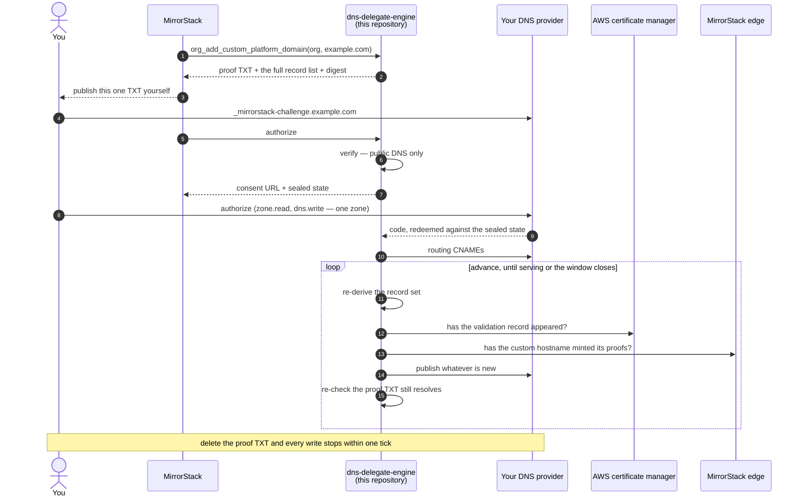

# The intent-based API

The shape this service is being rebuilt into: MirrorStack's private half names a
**domain and an intent**, and can no longer name a DNS record at all.

> **Status: design. Not built.** What runs today is described in
> [`../README.md`](../README.md), and where the two disagree, the README is the
> truth. This is here first, and in public, because the design is the part your
> developers most need to argue with — after it ships is too late to tell us it
> is wrong.

---

## Why the current shape cannot answer the question

Today this service takes `Publish(records)`. Every byte that reaches your zone
comes from that list. Anchor containment bounds a record's **name** to a suffix
of the anchor, and **nothing bounds its value**. So the private half can publish,
with every check here passing:

```
CNAME  account.example.com          →  attacker.example
TXT    _acme-challenge.example.com  →  a third party's ACME token
```

The first puts a session host inside your own domain in front of someone else's
origin. The second lets that third party obtain a publicly-trusted certificate
for your hostname — and the never-replace rule is CNAME-only, because TXT records
always *add*, and a certificate authority accepts any matching TXT among several
at one owner.

Reading this repository tells you **where** we can write and nothing about
**what**. That is what the rebuild fixes.

There is a second defect, and it is the one everything else follows from: **the
anchor is not proven.** The ownership TXT is inside the record set *we* publish,
and the gate on creating a custom hostname is a public lookup for that same
record. The proof is satisfied by our own write.

So the change is not only "send an intent instead of a record list". It is:

> **The record that proves the anchor becomes one you publish, and it is
> re-checked on every pass.**

Without that, an intent API still lets a compromised private half aim this
service at any name inside a zone you authorized — your provider's consent
screen names the *zone*, never the subdomain — and it would claim a property it
does not have, which is worse than today.

---

## The three lanes

| | 1 · org platform domain | 2 · org app domain | 3 · each app domain |
|---|---|---|---|
| example | `example.com` | `example.net` | `example.org` |
| what it is | the org's console on its own hostname | a parent under which every app is **auto-routed** at `<app-slug>.example.net` | one arbitrary domain bound to **one app** |
| identity | the org | the org | **the app and its owner — which may be a person** |
| anchor | `example.com` | `example.net` | `example.org` |
| hosts | `account.` `api.` `apps.` `cdn.` | auto-routed, one per app | itself |
| grant | 24 hours | standing | standing, for renewals |

All three are authorized the same way — a provider grant scoped to one zone, held
by this service — and all three are bounded by a proof you published at the
anchor. There is no lane with a weaker path, which is the point of listing them
together.

Lane 3 is the one to read carefully. It is not "an app under the org's parent" —
it is a domain someone attaches to a single app, and it must work when there is
no organization at all. That is why it cannot be folded into lane 2, and why it
needs its own identity rather than an `orgId`. Its anchor is also the tightest of
the three: the anchor **is** the hostname, so nothing is derived beneath it and
nothing beside it in that zone is reachable.

> **Migration note.** Lanes 1 and 2 run through this service today. Lane 3 does
> not: it still uses an older path in the private half where a Cloudflare API
> token is pasted, with no anchor and no digest. Bringing it onto the design
> below is a migration, not a new feature, and it is the reason the third intent
> exists.

---

## The three intents

These are the only entry points. Each takes a name and an identity, and returns
the proof you must publish before anything else happens.

### `org_add_custom_platform_domain(orgId, domain)`

Registers the org's console domain. Derives the four sibling hostnames from a
fixed label table — `account` `api` `apps` `cdn` — so the caller cannot add a
fifth or rename one.

Returns the anchor, the derived hostnames, the ownership proof to publish, the
full record list, and the plan digest. **Touches no credential and writes
nothing.**

### `org_add_custom_app_domain(orgId, domain)`

Registers the parent under which the org's apps are auto-routed. Derives exactly
one routing record, the wildcard, plus the ownership proof.

Individual apps are not named here and never need to be: the slug decides the
hostname and the wildcard routes it. What each app still owes is its own
certificate records, which arrive later through `advance`.

### `app_add_custom_domain(appId, hostname)`

Registers one arbitrary domain against one app. **Takes an app, not an org** —
the owner may be a person, and this lane has to work with no organization
anywhere in the request.

The anchor is the hostname itself, so this is the tightest of the three: nothing
under it is derived, and nothing beside it is reachable.

**This lane is a migration, not a new feature** — see the migration note above.
This intent is what brings it onto the same footing as the other two: the same
provider grant, the same proof at the anchor, the same refusals.

---

## The lifecycle functions

The same seven for all three lanes, which is the point: one implementation, one
set of refusals, no lane with a weaker path.

### `verify(registration)`

Resolves the ownership proof in **public DNS** and reports whether it is present.

The caller cannot say what to look for and cannot supply a value that makes it
pass — the expected value is recomputed here from the sealed registration. This
is the function that makes "proven" mean something.

### `authorize(registration, codeChallenge)`

Returns the provider's consent URL, and mints the OAuth `state` itself as a
short-lived sealed envelope carrying the lane, the identity, the anchor and a
nonce.

**Refuses unless `verify` passes right now.** The caller echoes the state back
and cannot author one.

### `complete(state, code, codeVerifier, expectDigest)`

Exchanges the authorization code, seals the resulting credential, and publishes
the records that are knowable at this moment.

**Takes no identity, no lane and no domain** — all three come from the sealed
`state`. That is what makes `authorize` and `complete` cryptographically the same
act, rather than two requests whose fields are checked against each other.
`expectDigest` is **required**; an empty value is refused, because an optional
integrity check is a claim rather than a control.

### `advance(registration, grant)`

One pass of the loop, and the only function that writes after the first publish.

Re-derives the record set, re-checks the ownership proof still resolves, asks AWS
and Cloudflare whether the records they owe have appeared, and publishes whatever
is missing. Returns the rotated credential **even when it fails**, because the
provider rotates on use and a failure that loses the new one strands the grant.

### `describe(registration)`

Read-only. Every record, its purpose, and whether it is present, absent,
conflicting, or the wrong type. Writes nothing, and is the single source for what
a console shows you — so the screen and the writer cannot drift apart.

### `orphans(registration, grant)`

Reports what we left behind when a domain is removed. **A report, never a
mutation.** There is still no delete anywhere in this service, and adding one is
still a design change rather than a refactor: no provider in scope offers a
conditional mutation, so a compensating delete cannot prove it is undoing *our*
write rather than clobbering an edit you made a second ago.

### `release(registration, grant, reason)`

Revokes at the provider, refresh token first. An envelope that cannot be opened
is reported as such and never guessed at.

Two more exist and write nothing: `capabilities()`, which publishes the routing
targets and scopes this deployment actually uses, and `health()`, which publishes
the deployed commit so every other property here is verifiable rather than merely
readable.

---

## What the caller can send

Across every function above, the private half supplies these and nothing else:

| field | validation |
|---|---|
| `orgId` / `appId` | canonical 36-character hyphenated UUID, strict |
| `lane` | one of three |
| `domain` | one DNS name, ≤253, LDH labels, refused if under a MirrorStack suffix |
| `code` / `codeVerifier` / `codeChallenge` | provider and PKCE; reach no record |
| sealed envelopes | ciphertext this service issued |

There is **no records field, no value, no target, no proxy flag, no certificate
id, no hostname id, no ownership token, no expiry, no stage.**

A reflection test walks every request struct and **fails on any type it does not
recognise**, so a map or a raw JSON field is rejected by default rather than by
having been thought of.

---

## Where state lives

**This service still owns no database.** Not by sealing the lifecycle, but by
deleting it: the certificate id, the custom-hostname id and the published-record
cursor are removed from the model and re-read from AWS, from Cloudflare and from
your own zone on every pass.

What stays sealed is a credential and a clock, both monotone-safe under replay —
rolling one back grants no authority it did not already carry. The private half
stores the envelopes and hands them back; it cannot author, edit or reorder one.

The honest limit: a sealed envelope can be **withheld**. The private half can
always decline to advance a domain. What it cannot do is advance one further than
you proved.

---

## What each lane writes

| # | name | type | value | lane | written by |
|---|---|---|---|---|---|
| 1 | `_mirrorstack-challenge.<anchor>` | TXT | `HMAC(K, lane‖id‖anchor)` | all three | 🔴 **you, by hand** |
| 2 | `account api apps cdn .<anchor>` | CNAME | the org routing target | 1 | this service |
| 3 | `*.<anchor>` | CNAME | the app routing target | 2 | this service |
| 4 | `<hostname>` | CNAME | the app routing target | 3 | this service |
| 5 | `_<token>.<host>` | CNAME | `….acm-validations.aws` | 1 only | relayed from AWS |
| 6 | `_acme-challenge.<host>` | TXT | the DV token | all three | relayed from Cloudflare |
| 7 | `_cf-custom-hostname.<host>` | TXT | the serving proof | all three | relayed from Cloudflare |

**Records 5, 6 and 7 are relayed, not derived.** This service derives *that* a
proof must exist and *why*; the bytes come from AWS and Cloudflare. "The engine
derives the record set" is true of which proofs exist and false of every byte,
and both halves of that belong in public.

**The proof value differs per lane**, because the lane is inside the HMAC. A
console proof does not authorize an app-domain wildcard, and neither authorizes a
domain on a single app. Each is a deliberate, separate act.

**No A, AAAA, MX, NS or CAA, ever.** CNAME and TXT only.

---

## The sequence

Two of these records are answers from someone else that do not exist when you
authorize. That is why this is a convergence loop rather than a script, and why
the credential is held rather than spent once.



The self-arrows are the point. Step by step this is a script; the loop is what
makes it converge, and the re-check inside it is what makes your stop control
real rather than advisory.

Lanes 2 and 3 have the same skeleton with a loop that does not end — for lane 2,
each newly auto-routed app owes certificate records; for lane 3, renewals. That
is the honest picture of a standing grant.

Ordering that is genuinely forced, rather than incidental:

- The custom hostname is not created until the proof TXT resolves publicly, so
  record 7 cannot precede record 1.
- Cloudflare mints record 6 only after the routing record resolves, so it cannot
  precede record 2, 3 or 4.
- AWS returns a certificate id immediately and its validation record seconds
  later, so a fresh host is routinely "requested, record not known yet" for the
  first minutes of its life. That is a wait, not a fault.

---

## Still open

Recorded here rather than settled quietly, because each changes what you are
agreeing to:

1. **The wildcard lane needs its own consent surface.** A proof per lane forces a
   separate act, but `*.<anchor>` covers every name you have not listed, and the
   only description of that today comes from a console this repository cannot
   vouch for.
2. **We re-create a record you delete.** A service with no state cannot count
   deletions, and a counter in a sealed blob is rollback-able in the direction
   that grants more authority. So the honest description is not "we write once
   when you authorize" but "we hold write access and continuously enforce a
   desired state in your zone, until you stop us."
3. **The scheduler.** The loop body moves here; the clock that fires it does not,
   at least at first. "The polling service is in this repository" will be true of
   every decision the loop makes and false of when it runs, and the documentation
   has to say which.
